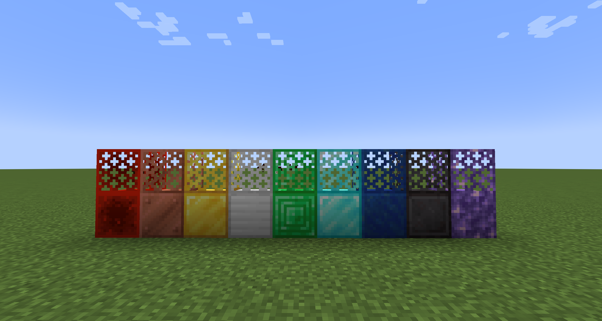
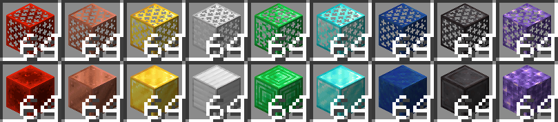

# Grate+

A simple mod that adds some new variants of grate based on vanilla blocks.

## Screenshots

## Added Variants of Grates

- Amethyst
- Diamond
- Emerald
- Gold
- Iron
- Lapis
- Netherite
- Redstone

## License

*Grate+* is distributed under MIT License. See [LICENSE](LICENSE) for more info.

This mod uses *Kotlin For Forge* for coding in Kotlin, which is licensed under LGPL-2.1 license, see
[Kotlin For Forge's license](https://github.com/thedarkcolour/KotlinForForge/blob/5.x/LICENSE) for more info.

This mod uses *NeoForge Template* as project template, which is licensed under the MIT license, see
[NeoForge Template's license](licenses/LICENSE-NeoForgeTemplate) for more info.